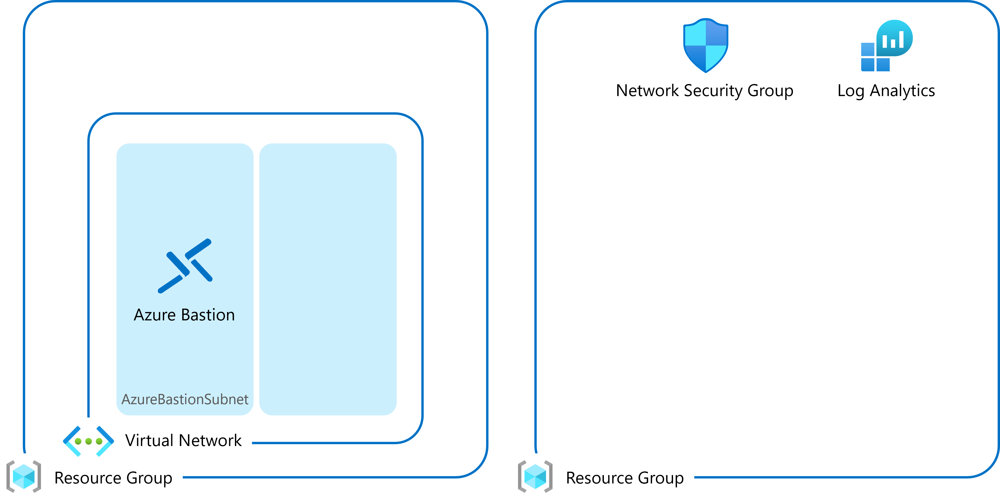

Azure-Fundamentals-Create-VMs
FY24

### 参考情報

- [名前付け規則を定義する](https://learn.microsoft.com/ja-jp/azure/cloud-adoption-framework/ready/azure-best-practices/resource-naming)

- [Azure リソースの種類に推奨される省略形](https://raw.githubusercontent.com/hiroyay-ms/AzureContainerApps-Hands-on-Lab-1/main/Before%20the%20HOL.md)

 

事前準備環境

 

### 共通リソースの展開

 

### パラメーター

- **virtualNetwork**: 仮想ネットワーク名（2 ～ 64 文字/英数字、アンダースコア、ピリオド、およびハイフン）

- **addressPrefix**: IPv4 アドレス空間

- **subnet1**: サブネットの名前 (1)（1 ～ 80 文字/英数字、アンダースコア、ピリオド、およびハイフン）

- **subnet1Prefix**: サブネット アドレス範囲 (1)

- **bastionPrefix**: AzureBastionSubnet サブネットのアドレス範囲

- **bastionHost**: Bastion リソースの名前（1 ～ 80 文字/英数字、アンダースコア、ピリオド、およびハイフン）

※ 事前にリソース グループの作成が必要

※ 選択したリソース グループのリージョンにすべてのリソースを展開

 

### リソースの展開

 

### パラメーター

- **networkSecurityGroup**: ネットワーク セキュリティ グループ名 (2 ～ 64 文字/英数字、アンダースコア、ピリオド、およびハイフン)

- **logAnalyticsWorkspace**: Log Analytics ワークスペース名 (4 ～ 63 文字/ 英数字、およびハイフン)

※ 事前にリソース グループの作成が必要

※ 選択したリソース グループのリージョンにすべてのリソースを展開

 