Azure Fundamentals - Create VMs  
Sep. 2023

<br />

### Contents

- [Exercise 1: 仮想ネットワーク・仮想ネットワーク ピアリング](#exercise-1-仮想ネットワーク・仮想ネットワーク-ピアリング)

- [Exercise 2: 仮想マシンの展開と構成](#exercise-2-仮想マシンの展開と構成)

- [Exercise 3: Bastion を使用した仮想マシンへの接続](#exercise-3-bastion-を使用した仮想マシンへの接続)

- [Exercise 4: 更新プログラム管理](#exercise-4-更新プログラム管理)

- [Exercise 5: 仮想マシンの監視](#exercise-5-仮想マシンの監視)

- [Exercise 6: バックアップ構成](#exercise-6-バックアップ構成)

- [Exercise 7: ファイル・フォルダー単位のバックアップ](#exercise-7-ファイル・フォルダー単位のバックアップ)

- [Exercise 8: 変更履歴の確認](#exercise-8-変更履歴の確認)

<br />

## Exercise 1: 仮想ネットワーク・仮想ネットワーク ピアリング

### Task 1: 仮想ネットワークの展開

- [Azure ポータル](#https://portal.azure.com)へアクセス

- **リソースの作成** をクリック

  

- 検索ボックスに **virtual network** と入力し、表示される候補より **virtual network** を選択

  

- **Virtual network** の **作成** ‐ **Virtual network** をクリック

  

‐ 仮想ネットワークの作成

  - **基本**

    - **プロジェクトの詳細**

      - **サブスクリプション**: ワークショップで使用中のサブスクリプション

      ‐ **リソース グループ**: ワークショップで使用中のリソース グループ
    
    - **インスタンスの詳細**

      - **仮想ネットワーク名**: 任意
      
      - **地域**: 任意

        

<br />

  - **セキュリティ**

    既定の設定（Azure Bastion, Azure Firewall, Azure DDos ネットワーク保護は無効）

<br />

  - **IP アドレス**

    - **IPv4 アドレス空間の追加**

      - **IPv4 アドレス空間**: 任意（/16 で既存の仮想ネットワークとの重複がない範囲を指定）
      
      - **サブネット**: 任意（/24 で IPv4 アドレス空間を変更した場合は、既存のサブネットを削除後、新規作成）

        

        <br />

    - サブネットの追加

      - **IPv アドレス空間**: 仮想ネットワークの IP アドレス空間
      
      - **サブネットの詳細**

        - **サブネット テンプレート**:　Default

        - **名前**: 任意

        - **開始アドレス**: 任意

        - **サブネット サイズ**: /24

      - **セキュリティ**

        - **NAT ゲートウェイ**: なし

        - **ネットワーク セキュリティ グループ**: 展開済みの NSG を選択

        - **ルート テーブル**: なし

          

  - **タグ**
  
    設定なし

- **確認 + 作成** をクリック、指定した内容を確認し **作成** をクリック

  

<br />

### Task 2: 仮想ネットワーク ピアリングの構成

- 作成した仮想ネットワークの管理ブレードへ移動

- **ピアリング** を選択し **＋ 追加** をクリック

  

- ピアリングの追加

  - この仮想ネットワーク

    - **ピアリング リンク名**: peer-spoke-to-hub（任意）

    - **リモート仮想ネットワークへのアクセスを許可する**: オン

  - リモート仮想ネットワーク

    - **ピアリング リンク名**: peer-hub-to-spoke（任意）

    - **仮想ネットワークのデプロイ モデル**: Resource Manager

    - **サブスクリプション**: ワークショップで使用中のサブスクリプション

    - **仮想ネットワーク**: 事前展開済みの仮想ネットワーク

    - **現在の仮想ネットワークへのアクセスを許可する**: オン

      

- **追加** をクリックし、仮想ネットワーク ピアリングを構成

<br />

## Exercise 2: 仮想マシンの展開と構成

### Task 1: 仮想マシンの展開

- **リソースの作成** をクリック

  

- **仮想マシン** の **作成** をクリック

- 仮想マシンの作成

  - **基本**

    - **プロジェクトの詳細**

      - **サブスクリプション**: ワークショップで使用中のサブスクリプション

      ‐ **リソース グループ**: ワークショップで使用中のリソース グループ

    - **インスタンスの詳細**

      - **仮想マシン名**: 任意

      - **地域**: 仮想ネットワークを展開した地域を選択

      - **可用性オプション**: インフラストラクチャ冗長は必要ありません

      - **セキュリティの種類**: Standard

      - **イメージ**: Windows Server 2022 Datacenter - x64 Gen2

      - **VM アーキテクチャ**: x64

      - **サイズ**: 任意（2 vcpu 数のサイズを選択）

    - **管理者アカウント**

      - **ユーザー名**: 任意

      - **パスワード**: 英大文字・小文字、数字、特殊文字の 3 つを含む 1 ～ 20 文字

    - **受信ポートの規則**

      - **パブリック受信ポート**: なし

      

<br />

  - **ディスク**

    - **OS ディスク**

      - **OS ディスクの種類**: Standard SSD

      - **VM と共に削除**: オン

      

<br />

  - **ネットワーク**

    - **ネットワーク インターフェイス**

      - **仮想ネットワーク**: 作成した仮想ネットワークを選択

      - **サブネット**: 仮想ネットワーク内のサブネットを選択

      - **パブリック IP**: なし

      - **NIC ネットワーク セキュリティ グループ**: なし

      - **VM が削除されたときに NIC を削除する**: オン
    
    - **負荷分散**

      - **負荷分散のオプション**: なし

      

<br />

  - **管理**

    既定の設定のまま

    

<br />

  - **監視**

    既定の設定のまま

    

<br />

  - **詳細**

    既定の設定のまま

    

- **確認および作成** をクリック、指定した内容を確認し **作成** をクリック

  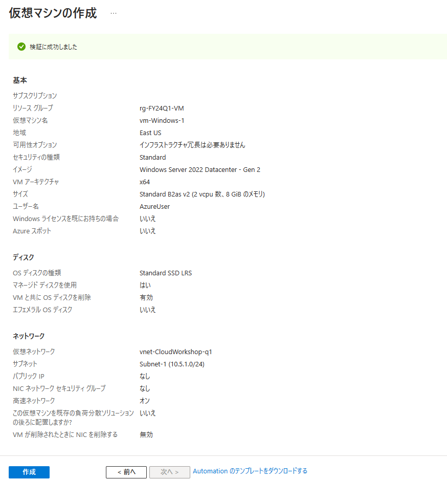

<br />

### Task 2: 静的 IP アドレスの割り当て

- 作成した仮想マシンの管理ブレードへ移動し、**ネットワーク** を選択

- ネットワーク インターフェイスをクリック

  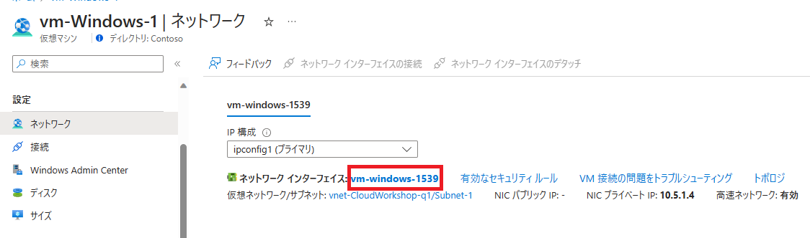

- **IP 構成** を選択し **ipconfig1** をクリック

  

- **IP 構成の編集** の **プライベート IP アドレスの設定** ‐ **割り当て** で **静的** を選択

  任意のプライベート IP アドレスを指定（現在割り当て中のものでも OK）

  

- **保存** をクリックし、プライベート IP アドレスの割り当てが静的に変更されたことを確認

  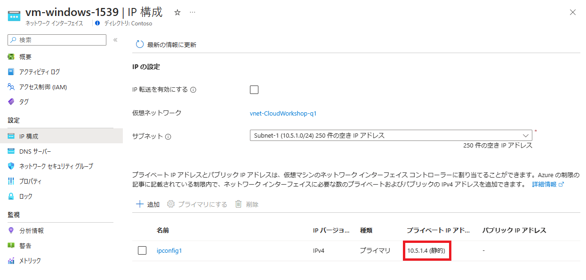

<br />

### Task 3: ディスクの追加

- 仮想マシンの管理ブレードで **ディスク** を選択、**＋ 新しいディスクを作成し接続する** をクリック

  

- ディスク名を入力し、種類とサイズを指定

  

  ※ 新しいディスクの初期化は、後の手順で仮想マシンに接続して設定

<br />

### Task 4:仮想マシン サイズの変更

- 仮想マシンの管理ブレードで **サイズ** を選択

- 利用可能なサイズの一覧から新しいサイズを選択し **サイズの変更** をクリック

  

  ※ 仮想マシンが実行中の場合、サイズを変更した際は再起動を実施

<br />

## Exercise 3: Bastion を使用した仮想マシンへの接続

### Task 1: 仮想マシンへの接続

- 仮想マシンの管理ブレードで **Bastion** を選択

- ユーザー名、VM パスワードを入力し **接続** をクリック

  

  ※ ポップアップ ブロックが表示された際は解除

  ※ Azure Bastion セッションの初期化中にクリップボードへのアクセスを求めるメッセージが表示された場合は **許可** を選択

- 新しいタブで接続した仮想マシンのデスクトップが表示

  

- 画面左の **》** をクリックし、クリップボード アクセス ツール パレットを表示

  ※ ローカル コンピューターからテキストをコピーした場合、クリップボード アクセス ツール パレットに自動表示

- 仮想マシンの画面を全画面表示する際は **Fullscreen** をクリック

  

  ※ 全画面表示を解除する際は **Esc** キーを押下

<br />

- エクスプローラーを起動、C ドライブ直下に新しいフォルダを作成し、フォルダ内に新しいテキスト ファイルを作成

  

  ※ テキスト ファイル内には現在の時刻など任意の文字列を記述し保存

<br />

### Task 2: ディスクの初期化

- スタート ボタンを右クリックし **Computer Management** を選択

  

- **Initial Disk** ダイアログが表示されるので **OK** をクリック

  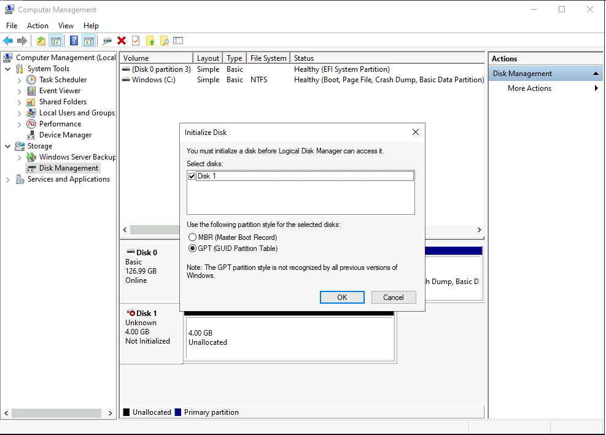

- Unallocated ディスクを右クリックし **New Simple Volume ...** をクリック

  

- 割り当てるドライブ レターを選択し **Next >** をクリック

  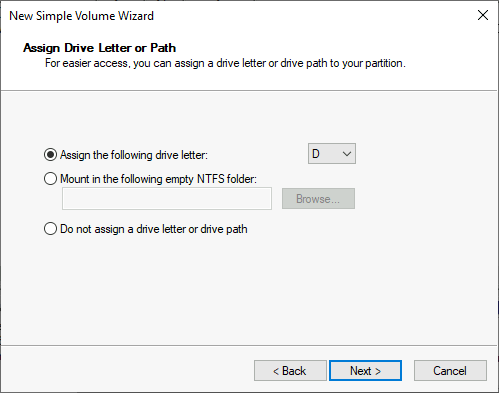

  ※ 一時ディスクが接続されている仮想マシン場合は E が選択

- 既定の設定のまま **Next >** をクリック

  

- 選択したドライブ レターで新しいドライブが割り当てられたことを確認

  

- 仮想マシンからサインアウト

<br />

### Task 3: 共有可能リンクを使用した仮想マシンへの接続

- Azure Bastion の管理ブレードへ移動し **構成** を選択し、SKU レベル、および有効化されている機能を確認

  

- **共有可能リンク** を選択し **＋ 追加** をクリック

  

- **共有可能リンクの作成** で接続対象となる仮想マシンを選択し **適用** をクリック

  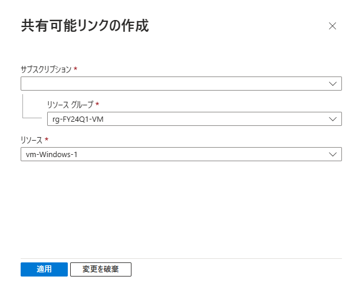

- 作成された共有可能リンクの URL をコピー

  

- 新しいブラウザを起動し、アドレス バーにコピーした URL を貼り付け、Enter キーを押下しアクセス

- 資格情報を入力し **Login** をクリック

  

- 仮想マシンのデスクトップ画面が表示

  

<br />

## Exercise 4: 更新プログラム管理

### Task 1: バッチ オーケストレーション オプションの設定

- 仮想マシンの管理ブレードへ移動し **更新プログラム** を選択し **設定の更新** をクリック

  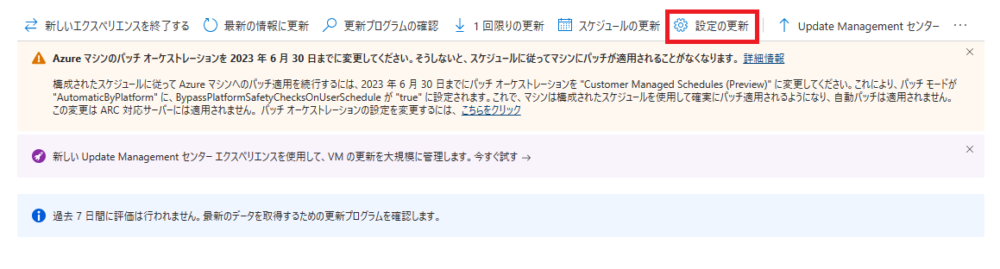

- 定期評価、バッチ オーケストレーションを選択し **保存** をクリック

  - **定期評価**: 有効

  - **バッチ オーケストレーション**: Customer Managed Schedules (Preview)

    

- **更新プログラムの確認** をクリック

- **今すぐ評価をトリガーする** のメッセージが表示されるので **OK** をクリックし、更新プログラムの確認を開始

<br />

### Task 2: メンテナンス構成の作成

- **スケジュール** タブを表示し **＋ メンテナンス構成の作成** をクリック

  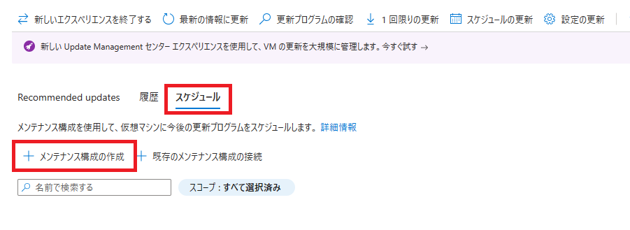

- メンテナンス構成の作成

  - **プロジェクトの詳細**

    - **サブスクリプション**: ワークショップで使用中のサブスクリプション

    - **リソース グループ**: ワークショップで使用中のリソース グループ

  - **インスタンスの詳細**

    - **構成名**: 任意

    - **地域**: 仮想マシンを展開している地域

    - **メンテナンス スコープ**: ゲスト (Azure VM, Arc 対応 VM/サーバー)

    - **再起動の設定**: 必要に応じて再起動

    - **スケジュール**: スケジュールの追加をクリック

      

      - スケジュールの追加または変更

        - **開始日**: 日付、時間、タイムゾーンを選択

        - **メンテナンス期間**: 既定（時間: 3 / 分: 55）

        - **繰り返し**: 1 月

          - **曜日**: 第 2 水曜日

          - **オフセット (経過日数)**: 0
        
        - **終了日の追加**: オフ

          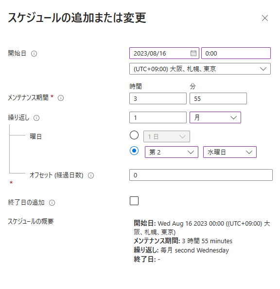

          <br />

  - 指定したスケジュールが反映されていることを確認し **次: DynamicScopes >** をクリック

    

  - **動的スコープ (プレビュー)**

    設定なし

    


  - **マシン**

    作成した仮想マシンが追加されていることを確認

    

  - **更新プログラム**

    既定のまま

    

    ※ 更新プログラムの分類や含める/除外する KB を設定可

- **確認および作成** をクリックし、指定した内容を確認、**作成** をクリック

  

- 作成したメンテナンス構成が追加されることを確認

  

<br />

### Task 3: 手動での更新プログラムのインストール

- **↓ 1 回限りの更新** をクリック

  

- 作成した仮想マシンが表示されていることを確認

  

‐ 複数の更新プログラムが確認されている場合、再起動が必要なものを除外指定

  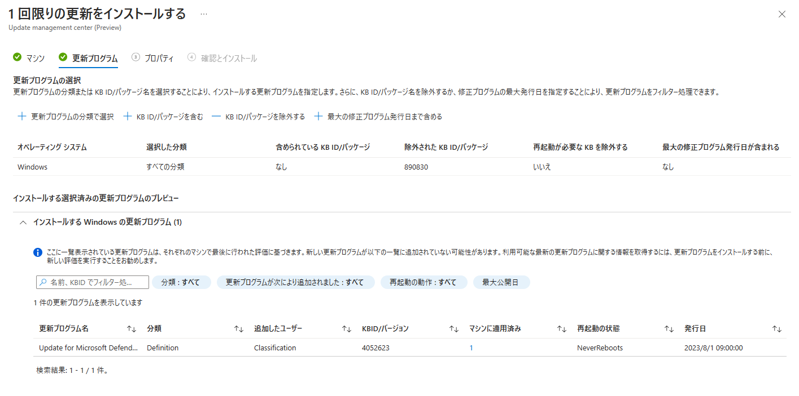

- 再起動オプションとメンテナンス期間を指定

  - **再起動オプション**: 再起動しない

  - **メンテナンス期間 (分)**: 60

    

- 指定した内容を確認し **インストール** をクリック

  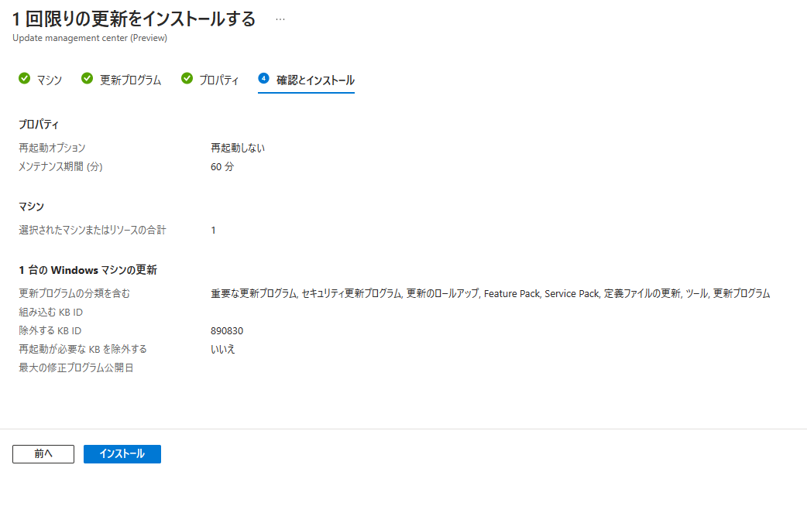

- インストール結果は履歴で確認可

  

<br />

## Exercise 5: 仮想マシンの監視

### Task 1: 監視の有効化

- 仮想マシンの管理ブレードから **分析情報** 情報を選択し、**有効** をクリック

  

- 監査の構成

  - **次を使用した分析情報を有効にする**: Azure Monitor エージェント (推奨)

  - **サブスクリプション**: ワークショップで使用中のサブスクリプション

  - **データ収集ルール**: 新規作成をクリック

    

    <br />

    - 新しいルールの作成

      - **データ収集ルール名**: 任意 (MSVMI‐ がルール名の先頭に自動追加)

      - **ゲスト パフォーマンスを有効にする**: オン（既定、変更不可）

      - **プロセスと依存関係**

        - **プロセスと依存関係 (マップ) を有効にする**: オン

        - **サブスクリプション**: ワークショップで使用中のサブスクリプション

        - **Log Analytics workspaces**: 展開済みのものを選択

          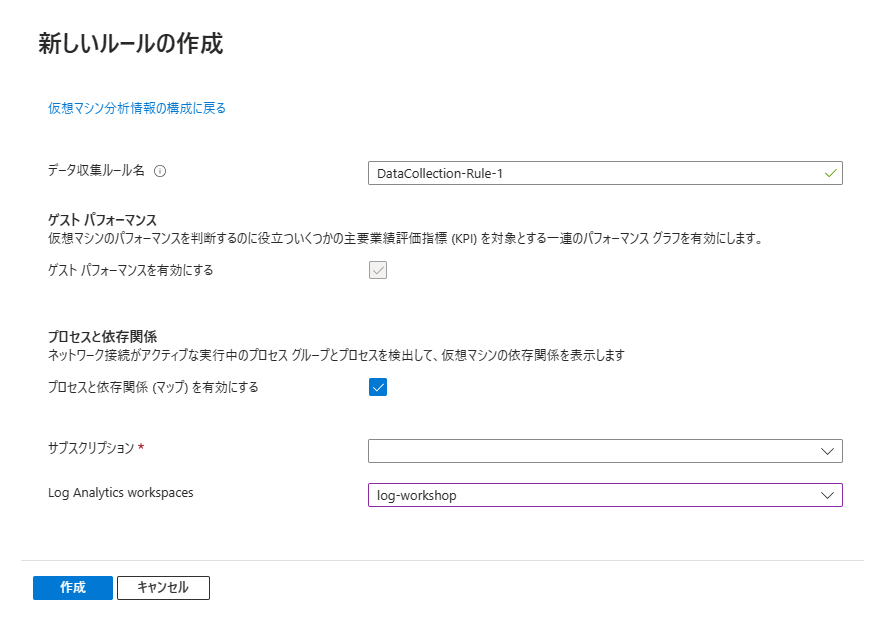

          <br />

  - 作成したデータ収集ルールが選択されていることを確認し **構成** をクリック

    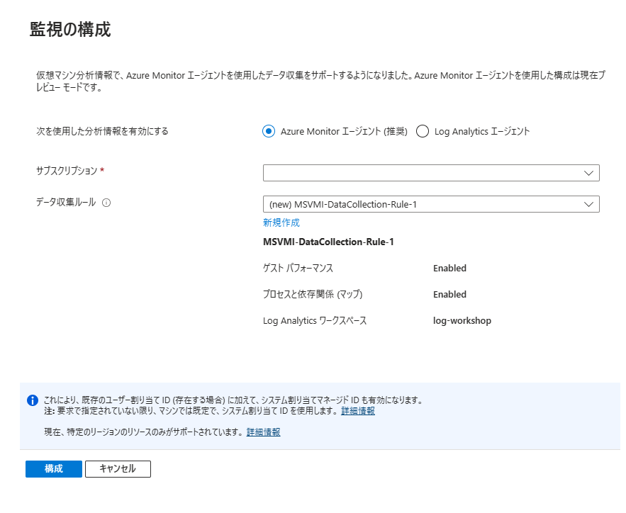

- 構成完了後、収集したデータをもとにパフォーマンス状況や実行中のプロセスを確認可

  - **パフォーマンス**

    

  - **マップ**

    

<br />

### Task 2: データ収集ルールの更新

- Azure Monitor の管理ブレードから **データ収集ルール** を選択

  

- **データ ソース** を選択し **＋ 追加** をクリック

  

- **データ ソースの種類** で **Windows イベント ログ** を選択、**基本** を選択し、ログ レベルはすべて選択

  

<br />

## Exercise 6: 仮想マシンのバックアップ

### Task 1: Recovery Services コンテナの作成と構成

- Azure ポータルのトップ画面の検索バーに **バックアップ センター** と入力し、表示される候補の **バックアップ センター** を選択

  

- **＋ コンテナー** をクリック

  

- コンテナーの種類で **Recovery Services vault** を選択し、**続行** をクリック

  

- Recovery Services コンテナーの作成

  - **基本**

    - **プロジェクトの詳細**

      - **サブスクリプション**: ワークショップで使用中のサブスクリプション

      - **リソース グループ: ワークショップで使用中のリソース グループ

    - **インスタンスの詳細**

      - **資格情報コンテナー名**: 任意

      - **リージョン**: 仮想マシンを展開したリージョン1

        

        <br />

  - **コンテナーのプロパティ**

    - **不変性を有効にする**: オン

      

      <br />

  - **ネットワーク**

    - **接続方法**: すべてのネットワークからのパブリック アクセスを許可する

      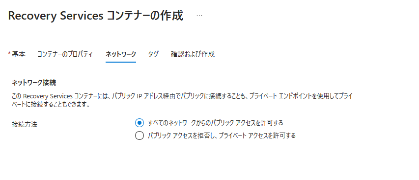

      <br />

- **確認および作成** をクリック、指定した内容を確認し **作成** をクリック

  

  <br />

- 展開完了後、作成した Recovery Services コンテナーの管理ブレードへ移動

- **プロパティ** を選択、**バックアップ構成** の **更新** をクリック

  

- リージョンをまたがる復元で **有効にする** を選択し **保存** をクリック

  

<br />

### Task 2: バックアップ ポリシーの作成

- バックアップ センターへ移動、**＋ ポリシー** をクリック

  

- **データソースの種類** で **Azure 仮想マシン** を選択し、**コンテナーの選択** をクリック

  

- 作成した Recovery Services コンテナーを選択し **選択** をクリック

  

- **続行** をクリック

  

- ポリシーの作成

  - **ポリシーのサブタイプ**: Standard

  - **Standard 保護**

    - **ポリシー名**: 任意

  - **バックアップ スケジュール**

    - **頻度**: 毎日

    - **時間**: 0:00

    - **タイムゾーン**: (UTC+9:00) 大阪、札幌、東京

  - **インスタント復元**

    - **インスタント回復スナップショットの保有期間**: 1 日

  - **保持期間の範囲**

    - **毎日のバックアップ ポイントの保有期間**: 7 日

    - **毎週のバックアップ ポイントの保有期間**: オン（日曜日、4 週）

    - **毎月のバックアップ ポイントの保有期間**: オン（週ベース、最終日曜日、6 月）

      

      <br />

- **作成** をクリックし、ポリシーを作成

<br />

### Task 3: バックアップの構成

- バックアップ センターへ移動、**＋ バックアップ** をクリック

  

- バックアップ対象、Recovery Services コンテナーを選択し **続行** をクリック

  - **データソースの種類**: Azure 仮想マシン
  
  - **コンテナーの種類**: Recovery Services vault

  - **コンテナー**: 作成した Recovery Services コンテナーを選択

    

    <br />

- バックアップの構成

  - **ポリシーのサブタイプ**: Standard

  - **バックアップ ポリシー**: 作成したバックアップ ポリシーを選択

  - **仮想マシン**: 追加をクリックし、展開済みの仮想マシンを選択

    

    <br />

- **バックアップの有効化** をクリック

  ※ バックアップが有効化されている仮想マシンではオンデマンドでバックアップも可

    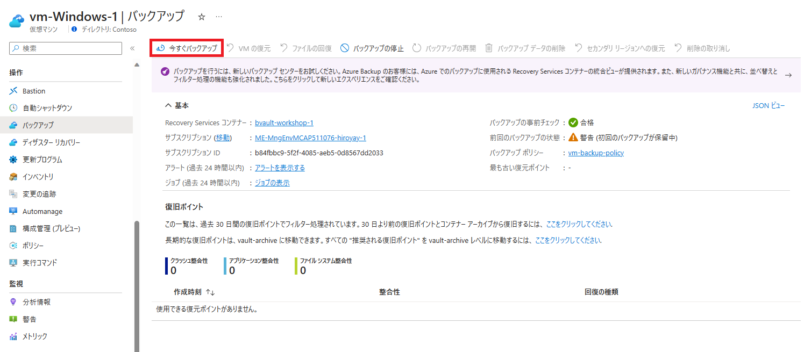

<br />

## Exercise 7: ファイルとフォルダーのバックアップ

### Task 1: MARS エージェントのインストールとサーバーの登録

- 仮想マシンへ Bastion を使用して接続し、Azure ポータルへアクセス

- Recovery Services コンテナーの管理ブレードへ移動し、**プロパティ** を選択

- **Recovery Services Agent** の **ダウンロード** をクリックし、任意の場所へ保存

- **Backup の資格情報** ‐ **最新の Recovery Services Agent を既に使用している** にチェック、

  **ダウンロード** をクリックし、資格情報ファイルを任意の場所へ保存

  

  <br />

- ダウンロードした MARS エージェントのインストーラーを起動

- **Installation Settins** でインストール先、キャッシュ場所 (送信前データの格納先) を指定し **Next** をクリック

  

  <br />

- **Proxy Configuration** は設定を行わないので、**Next**： をクリック

  

  <br />

- **Microsoft Update Opt-In** は **Use Microsoft Update when I check for updates** を選択し **Next** をクリック

  

  <br />

- **Install** をクリックし、MARS エージェントのインストールを実行

  

  <br />

- インストール完了後、**Proceed to Registration** をクリック

  

  <br />

- サーバー登録ウィザードが起動

  ダウンロードした資格情報ファイルを指定し **Next** をクリック

  

  <br />

- **Encryption Setting** で **Generate Passphrase** をクリックし、パスフレーズを生成

  生成したパスフレーズ ファイルを指定する任意の場所を指定

  

  <br />

  ※ パスフレーズ ファイルの保存先にローカルを指定した際は警告が表示

  ※ 次の手順に進む場合は Yes をクリック

  

- サーバーの登録が正常に完了することを確認

  **Launch Microsoft Agent Recovery Services Agent** にチェックを付け **Close** をクリック

  

<br />

### Task 2: バックアップ ポリシーの作成

- エージェント コンソールを起動

  スタート メニューで Microsoft Azure Backup を検索、またはデスクトップ上のショートカットをダブルクリック

- **Action** メニューから **Schedule Backup** を選択

- バックアップのスケジュール ウィザードが起動、**Next** をクリック

  

  <br />

- バックアップする項目の選択で **Add Items** をクリック

  

  <br />

- **項目の選択** ボックスで、バックアップする項目を選択し **OK** をクリック

  

  ※ Bastion から仮想マシンに接続時に C ドライブ直下に作成したフォルダと追加したドライブを選択

- 選択したフォルダ、ドライブが追加されていることを確認し **Next** をクリック

  

  <br />

- **バックアップのスケジュール選択** で、バックアップの実行時間を指定

  - **Schedule a backup every**: Day

  - **At following times**: 11:30 PM

    

    <br />

- **保持ポリシーの選択** で、保存する復旧ポイントと保持期間を設定

  - **Daily Retention Policy**: 既定で選択（変更不可）、7 日

  - **Weekly Retention Policy**: オン（Saturday, 11:30 PM, 2 Weeks）

    

    <br />

- **初期バックアップの種類の選択** で **Online** を選択し **Next** をクリック

  

  <br />

- 指定した内容を確認し **Finish** をクリック

  

  <br />

- バックアップ スケジュールの作成の完了を待ち **Close** をクリック

  

<br />

### Task 3: オンデマンド バックアップの実行

- エージェント コンソールを起動

- **Action** メニューから **Back Up Now** を選択

- **バックアップ アイテムの選択** で **Files and Folders** を選択し **Next** をクリック

  

  <br />

- **バックアップの保持期間** でカレンダーから日付を選択し **Next** をクリック

  

  <br />

- バックアップ ポリシー作成時に選択した項目が表示されることを確認し **Backup** をクリック

  

  <br />

- バックアップ ジョブが開始

  

  <br />

- **Close** をクリックし、ウィザードを終了（バックアップ ジョブはバックグラウンドで実行を継続）

<br />

### Task 4: ファイルの復元

- バックアップを取得したファイルの内容を変更、または削除

  

  <br />

- エージェント コンソールを起動

- **Action** メニューから **Recover Data** を選択

- **Getting Started** で **This server** を選択し **Next** をクリック

  

  <br />

- **回復モードの選択** で **Indivisual files and folders** を選択

  

  <br />

- **ボリュームと日付の選択** で復元するファイルを含むボリュームを選択

  カレンダーから太字で表示される日付を選択、 **Time** から特定の復旧ポイントを選択し、**Mount** をクリック

  

  <br />

- **ファイルの参照と回復** で **Browse** をクリック

  

  <br />

- エクスプローラーが起動、復元するファイルをコピーし、元の場所へ貼り付け

  

  ※ 更新（削除）前の状態にファイルが復元されたことを確認

  <br />

- **Unmount** をクリック、メッセージが表示されるので **Yes** を選択し、ボリュームをマウント解除

  

  ※ 回復ボリュームは 6 時間マウント、ファイル コピーが継続中は最大 7 日間までマウント時間を延長

<br />

## Exercise 8: 変更履歴の確認

### Task 1: クエリの実行

- 検索バーに **resource graph** と入力し、表示される候補の **Resource Graph エクスプローラー** を選択

  

  <br />

- クエリを記述し、実行

  ```
  resource changes
  | extend changeTime = todatetime(properties.changeAttributes.timestamp),
    targetResourceId = tostring(properties.targetResourceId), 
    changeType = tostring(properties.changeType), 
    correlationId = properties.changeAttributes.correlationId,
    previousValue = tostring(properties.changes["properties.hardwareProfile.vmSize"]["previousValue"]),
    newValue = tostring(properties.changes["properties.hardwareProfile.vmSize"]["newValue"]),
    changedProperties = properties.changes,
    changeCount = properties.changeAttributes.changesCount
  | where changeTime > ago(1d) and changeType == "Update" and changedProperties contains "hardwareProfile.vmSize"
  | order by changeTime desc
  | project changeTime, targetResourceId, changeType, correlationId, changeCount, previousValue, newValue, changedProperties 
  ```

  <br />

- リソースの変更履歴が管理されており、変更前・後の値が取得できることを確認

  

<br />